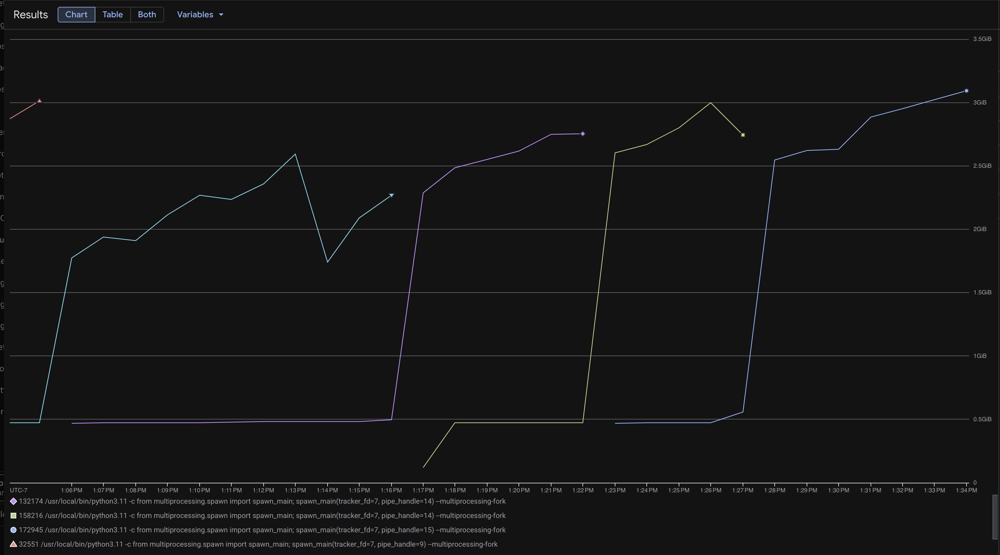

# Memory & CPU investigation — large payloads (LiteLLM v1.81.13)

**Version:** LiteLLM **v1.81.13**

**Problem statement:** High memory usage and CPU spikes when using large payloads on **`/v1/chat/completions`** and **`/v1/files`**. We use **`max_requests_before_restart`** in production, but for **few requests with very large bodies** it often does not recycle workers in time; LiteLLM has **no time-based worker restart**.

---

## Test setup (environment)

| Item | Detail |
|------|--------|
| **Cloud** | **GCP** |
| **Runtime** | **Docker Compose** on the instance |
| **Container limits** | **4 vCPU**, **4 GB** memory (per Compose `deploy.resources` / equivalent) |
| **Load generator** | **Client runs on a different machine** (not co-located on this server) |
| **Stack on server** | **LiteLLM**, **PostgreSQL**, **Redis**, **Prometheus**, **Datadog Agent** |
| **Upstream LLM** | **Mock LLM provider** (Compose service on this server) — used to service chat completion requests without a real provider bill |

---

## 1. `/v1/chat/completions`

We drive **`/v1/chat/completions`** with a **standalone loadtest script** (local tooling; not part of LiteLLM core tests) to reproduce **memory** and **CPU** behavior on the chat path.

| Result | Detail |
|--------|--------|
| **Leak check (bounded run)** | **leaks observed** for payload sizes **up to ~3 KB per request**, at **10 RPS**, for **30 minutes**. |
| **CPU** | **No clear CPU spike** observed in this run; **screenshots / graphs will be attached here** when available. |

**Summary**: There are leaks, heap memory does grow, but only when we dont restart the workers. Find the flamegraph with the leaky functions. These may / may not be leaky but these show up when running memray using the --leaks flag.

- [Memray Leak Summary](https://github.com/harish876/litellm/blob/ifood-oom-debug/memray-ifood-debug-base.html)


- Memray Allocation Summary
```
┏━━━━━━━━━━━━━━━━━━━━━━━━━━━━━━━━━━━━━━━━━━━━━━━━━━━━━━━━━━━━━━━━━━━━━━━━━━━┳━━━━━━━━━━━━━━━┳━━━━━━━━━━━━━━━┳━━━━━━━━━━━━━━━┳━━━━━━━━━━━━━━━┳━━━━━━━━━━━━━━┓
┃                                                                           ┃        <Total ┃  Total Memory ┃               ┃               ┃   Allocation ┃
┃ Location                                                                  ┃       Memory> ┃             % ┃    Own Memory ┃  Own Memory % ┃        Count ┃
┡━━━━━━━━━━━━━━━━━━━━━━━━━━━━━━━━━━━━━━━━━━━━━━━━━━━━━━━━━━━━━━━━━━━━━━━━━━━╇━━━━━━━━━━━━━━━╇━━━━━━━━━━━━━━━╇━━━━━━━━━━━━━━━╇━━━━━━━━━━━━━━━╇━━━━━━━━━━━━━━┩
│ run at /usr/local/lib/python3.13/asyncio/runners.py                       │     130.124MB │        91.74% │       2.329MB │         1.64% │       607753 │
│ run at /home/litellm/venv/lib/python3.13/site-packages/uvicorn/server.py  │     130.124MB │        91.74% │        0.000B │         0.00% │       607753 │
│ run at /home/litellm/venv/lib/python3.13/site-packages/uvicorn/main.py    │     130.124MB │        91.74% │        0.000B │         0.00% │       607753 │
│ run_server at                                                             │     130.124MB │        91.74% │        0.000B │         0.00% │       607753 │
│ /home/litellm/venv/lib/python3.13/site-packages/litellm/proxy/proxy_cli.… │               │               │               │               │              │
│ invoke at /home/litellm/venv/lib/python3.13/site-packages/click/core.py   │     130.124MB │        91.74% │        0.000B │         0.00% │       607753 │
│ main at /home/litellm/venv/lib/python3.13/site-packages/click/core.py     │     130.124MB │        91.74% │        0.000B │         0.00% │       607753 │
│ __call__ at /home/litellm/venv/lib/python3.13/site-packages/click/core.py │     130.124MB │        91.74% │        0.000B │         0.00% │       607753 │
│ <module> at /home/litellm/venv/bin/litellm                                │     130.124MB │        91.74% │        0.000B │         0.00% │       607753 │
│ func_wrapper at                                                           │      76.717MB │        54.09% │       1.394MB │         0.98% │       214510 │
│ /home/litellm/venv/lib/python3.13/site-packages/ddtrace/internal/compat.… │               │               │               │               │              │
│ coro at                                                                   │      46.950MB │        33.10% │      27.848kB │         0.02% │        83318 │
│ /home/litellm/venv/lib/python3.13/site-packages/starlette/middleware/bas… │               │               │               │               │              │
│ __call__ at                                                               │      46.872MB │        33.05% │      24.968kB │         0.02% │        82290 │
│ /home/litellm/venv/lib/python3.13/site-packages/starlette/middleware/cor… │               │               │               │               │              │
│ __call__ at                                                               │      46.791MB │        32.99% │      58.648kB │         0.04% │        81145 │
│ /home/litellm/venv/lib/python3.13/site-packages/starlette/middleware/exc… │               │               │               │               │              │
│ wrapped_app at                                                            │      46.731MB │        32.95% │      89.232kB │         0.06% │        80452 │
│ /home/litellm/venv/lib/python3.13/site-packages/starlette/_exception_han… │               │               │               │               │              │
│ __call__ at                                                               │      46.670MB │        32.90% │      23.592kB │         0.02% │        80077 │
│ /home/litellm/venv/lib/python3.13/site-packages/fastapi/middleware/async… │               │               │               │               │              │
│ __call__ at                                                               │      46.143MB │        32.53% │      27.784kB │         0.02% │        78615 │
│ /home/litellm/venv/lib/python3.13/site-packages/starlette/routing.py      │               │               │               │               │              │
│ app at                                                                    │      46.115MB │        32.51% │      15.040kB │         0.01% │        78524 │
│ /home/litellm/venv/lib/python3.13/site-packages/starlette/routing.py      │               │               │               │               │              │
│ handle at                                                                 │      46.012MB │        32.44% │      25.472kB │         0.02% │        77201 │
│ /home/litellm/venv/lib/python3.13/site-packages/starlette/routing.py      │               │               │               │               │              │
│ app at /home/litellm/venv/lib/python3.13/site-packages/fastapi/routing.py │      45.972MB │        32.41% │     804.945kB │         0.57% │        76699 │
│ solve_dependencies at                                                     │      38.968MB │        27.47% │     462.800kB │         0.33% │        22737 │
│ /home/litellm/venv/lib/python3.13/site-packages/fastapi/dependencies/uti… │               │               │               │               │              │
│ acompletion at                                                            │      38.751MB │        27.32% │     227.680kB │         0.16% │       202341 │
│ /home/litellm/venv/lib/python3.13/site-packages/litellm/router.py         │               │               │               │               │              │
│ user_api_key_auth at                                                      │      38.072MB │        26.84% │       4.640kB │         0.00% │        12365 │
│ /home/litellm/venv/lib/python3.13/site-packages/litellm/proxy/auth/user_… │               │               │               │               │              │
│ _read_request_body at                                                     │      37.743MB │        26.61% │      22.382MB │        15.78% │         7909 │
│ /home/litellm/venv/lib/python3.13/site-packages/litellm/proxy/common_uti… │               │               │               │               │              │
│ async_function_with_fallbacks at                                          │      35.863MB │        25.28% │     212.240kB │         0.15% │       180074 │
│ /home/litellm/venv/lib/python3.13/site-packages/litellm/router.py         │               │               │               │               │              │
│ async_function_with_retries at                                            │      32.561MB │        22.96% │     184.712kB │         0.13% │       152949 │
│ /home/litellm/venv/lib/python3.13/site-packages/litellm/router.py         │               │               │               │               │              │
│ make_call at                                                              │      32.221MB │        22.72% │     250.184kB │         0.18% │       150731 │
│ /home/litellm/venv/lib/python3.13/site-packages/litellm/router.py         │               │               │               │               │              │
│ _acompletion at                                                           │      31.956MB │        22.53% │     322.456kB │         0.23% │       149736 │
│ /home/litellm/venv/lib/python3.13/site-packages/litellm/router.py         │               │               │               │               │              │
│ wrapper_async at                                                          │      28.877MB │        20.36% │     385.728kB │         0.27% │       127532 │
│ /home/litellm/venv/lib/python3.13/site-packages/litellm/utils.py          │               │               │               │               │              │
│ acompletion at                                                            │      25.467MB │        17.95% │     687.480kB │         0.48% │       101843 │
│ /home/litellm/venv/lib/python3.13/site-packages/litellm/main.py           │               │               │               │               │              │
│ acompletion at                                                            │      24.452MB │        17.24% │     117.040kB │         0.08% │        96702 │
│ /home/litellm/venv/lib/python3.13/site-packages/litellm/llms/openai/open… │               │               │               │               │              │
│ async_wrapper at                                                          │      21.047MB │        14.84% │     127.936kB │         0.09% │        78458 │
│ /home/litellm/venv/lib/python3.13/site-packages/litellm/litellm_core_uti… │               │               │               │               │              │
│ make_openai_chat_completion_request at                                    │      20.902MB │        14.74% │     136.000kB │         0.10% │        76841 │
│ /home/litellm/venv/lib/python3.13/site-packages/litellm/llms/openai/open… │               │               │               │               │              │
│ wrapped at                                                                │      20.195MB │        14.24% │      40.630kB │         0.03% │        66880 │
│ /home/litellm/venv/lib/python3.13/site-packages/openai/_legacy_response.… │               │               │               │               │              │
│ create at                                                                 │      20.103MB │        14.17% │       4.221kB │         0.00% │        65972 │
│ /home/litellm/venv/lib/python3.13/site-packages/openai/resources/chat/co… │               │               │               │               │              │
│ post at                                                                   │      20.060MB │        14.14% │      70.224kB │         0.05% │        65196 │
│ /home/litellm/venv/lib/python3.13/site-packages/openai/_base_client.py    │               │               │               │               │              │
│ request at                                                                │      19.632MB │        13.84% │      66.752kB │         0.05% │        61735 │
│ /home/litellm/venv/lib/python3.13/site-packages/openai/_base_client.py    │               │               │               │               │              │
│ __init__ at                                                               │      16.466MB │        11.61% │     729.093kB │         0.51% │        21923 │
│ /home/litellm/venv/lib/python3.13/site-packages/httpx/_models.py          │               │               │               │               │              │
│ build_request at                                                          │      16.187MB │        11.41% │     247.456kB │         0.17% │        15065 │
│ /home/litellm/venv/lib/python3.13/site-packages/httpx/_client.py          │               │               │               │               │              │
│ _build_request at                                                         │      15.992MB │        11.27% │      256.000B │         0.00% │        18062 │
│ /home/litellm/venv/lib/python3.13/site-packages/openai/_base_client.py    │               │               │               │               │              │
│ body at                                                                   │      15.328MB │        10.81% │      15.032MB │        10.60% │         2779 │
│ /home/litellm/venv/lib/python3.13/site-packages/starlette/requests.py     │               │               │               │               │              │
│ encode_request at                                                         │      15.235MB │        10.74% │      13.824kB │         0.01% │          930 │
│ /home/litellm/venv/lib/python3.13/site-packages/httpx/_content.py         │               │               │               │               │              │
│ encode_json at                                                            │      14.771MB │        10.41% │      14.769MB │        10.41% │          450 │
│ /home/litellm/venv/lib/python3.13/site-packages/httpx/_content.py         │               │               │               │               │              │
│ async_success_handler at                                                  │       8.979MB │         6.33% │      95.592kB │         0.07% │        62256 │
│ /home/litellm/venv/lib/python3.13/site-packages/litellm/litellm_core_uti… │               │               │               │               │              │
│ wrapper at                                                                │       8.560MB │         6.04% │     154.048kB │         0.11% │        68837 │
│ /home/litellm/venv/lib/python3.13/site-packages/litellm/proxy/db/log_db_… │               │               │               │               │              │
│ chat_completion at                                                        │       8.240MB │         5.81% │     185.208kB │         0.13% │        64905 │
│ /home/litellm/venv/lib/python3.13/site-packages/litellm/proxy/proxy_serv… │               │               │               │               │              │
│ print_exception at /usr/local/lib/python3.13/traceback.py                 │       7.733MB │         5.45% │        0.000B │         0.00% │        87284 │
│ _extract_from_extended_frame_gen at                                       │       7.327MB │         5.17% │       1.112kB │         0.00% │        81391 │
│ /usr/local/lib/python3.13/traceback.py                                    │               │               │               │               │              │
│ __init__ at /usr/local/lib/python3.13/traceback.py                        │       7.311MB │         5.15% │      128.000B │         0.00% │        80719 │
│ line at /usr/local/lib/python3.13/traceback.py                            │       7.294MB │         5.14% │       64.000B │         0.00% │        80041 │
│ _set_lines at /usr/local/lib/python3.13/traceback.py                      │       7.294MB │         5.14% │       64.000B │         0.00% │        80040 │
└───────────────────────────────────────────────────────────────────────────┴───────────────┴───────────────┴───────────────┴───────────────┴──────────────┘

```
---

## 2. `/v1/files` (and related file routes)

**Summary:**
During batch file retrievals with large payloads, worker memory rises sharply and quickly approaches the container limit before worker recycling can occur, indicating that large file responses are being buffered in memory rather than streamed.

**OOM Error is not reached** but container memory usage reaches peak 98 - 99%. Payload sizes of 65MB used with 10,000 requests in parallel, according to the batch_lt.py script provided

Code Path (file_endpoints.py, line 716):
```
                response = await litellm.afile_content(
                    **{
                        "custom_llm_provider": custom_llm_provider,
                        "file_id": file_id,
                        **data,
                    }  # type: ignore
                )
``` 

**Steps**
- Ran **LiteLLM with 2 worker** and **with** `max_requests_before_restart`.
- Use **memray** (e.g. leak mode / `--leaks`) on the **files** path.
- **Mocked** file upstream / route so we can send a **~65 MB** payload through the proxy without relying on real provider keys, then attribute memory.


**Potential Resolution**
Without changing the current business logic, the potential fix could be:

 - Limitation of the openai SDK which returns BinaryResponse, instead of a streamed response.
 - We can wrap this API with a StreamingResponse handler, so that this can be mitigated. Again all signs point to this code path in the flamegraph as well.
 - Needs to be profiled after fix and before release.

**Data**

- [Memray Leak Summary](https://github.com/harish876/litellm/blob/ifood-oom-debug/memray-ifood-batch.html)

Container Memory Usage Graph (Workers Reach peak memory before uvicorn can restart)


Container Memory Consumption

```
khgokul@instance-20260329-212319:~/litellm-ifood-debug/litellm$ docker stats litellm-litellm-1 --no-stream
CONTAINER ID   NAME                CPU %     MEM USAGE / LIMIT   MEM %     NET I/O         BLOCK I/O       PIDS
c7505b5263d1   litellm-litellm-1   34.76%    3.335GiB / 4GiB     83.37%    201GB / 201GB   269MB / 400MB   80
khgokul@instance-20260329-212319:~/litellm-ifood-debug/litellm$ docker stats litellm-litellm-1 --no-stream
CONTAINER ID   NAME                CPU %     MEM USAGE / LIMIT   MEM %     NET I/O         BLOCK I/O       PIDS
c7505b5263d1   litellm-litellm-1   37.94%    3.58GiB / 4GiB      89.50%    206GB / 206GB   269MB / 400MB   83
khgokul@instance-20260329-212319:~/litellm-ifood-debug/litellm$ docker stats litellm-litellm-1 --no-stream
CONTAINER ID   NAME                CPU %     MEM USAGE / LIMIT   MEM %     NET I/O         BLOCK I/O       PIDS
c7505b5263d1   litellm-litellm-1   8.29%     3.512GiB / 4GiB     87.81%    206GB / 206GB   269MB / 400MB   83
khgokul@instance-20260329-212319:~/litellm-ifood-debug/litellm$ docker stats litellm-litellm-1 --no-stream
CONTAINER ID   NAME                CPU %     MEM USAGE / LIMIT   MEM %     NET I/O         BLOCK I/O       PIDS
c7505b5263d1   litellm-litellm-1   41.50%    3.656GiB / 4GiB     91.39%    214GB / 215GB   269MB / 400MB   83
khgokul@instance-20260329-212319:~/litellm-ifood-debug/litellm$ docker stats litellm-litellm-1 --no-stream
CONTAINER ID   NAME                CPU %     MEM USAGE / LIMIT   MEM %     NET I/O         BLOCK I/O       PIDS
c7505b5263d1   litellm-litellm-1   14.97%    3.781GiB / 4GiB     94.52%    214GB / 215GB   269MB / 400MB   83
khgokul@instance-20260329-212319:~/litellm-ifood-debug/litellm$ docker stats litellm-litellm-1 --no-stream
CONTAINER ID   NAME                CPU %     MEM USAGE / LIMIT   MEM %     NET I/O         BLOCK I/O       PIDS
c7505b5263d1   litellm-litellm-1   3.68%     3.495GiB / 4GiB     87.37%    236GB / 236GB   318MB / 400MB   82
khgokul@instance-20260329-212319:~/litellm-ifood-debug/litellm$ docker stats litellm-litellm-1 --no-stream
CONTAINER ID   NAME                CPU %     MEM USAGE / LIMIT   MEM %     NET I/O         BLOCK I/O       PIDS
c7505b5263d1   litellm-litellm-1   62.47%    3.69GiB / 4GiB      92.24%    236GB / 237GB   318MB / 400MB   82
khgokul@instance-20260329-212319:~/litellm-ifood-debug/litellm$ docker stats litellm-litellm-1 --no-stream
CONTAINER ID   NAME                CPU %     MEM USAGE / LIMIT   MEM %     NET I/O         BLOCK I/O       PIDS
c7505b5263d1   litellm-litellm-1   29.04%    3.687GiB / 4GiB     92.18%    240GB / 241GB   318MB / 400MB   82
khgokul@instance-20260329-212319:~/litellm-ifood-debug/litellm$ docker stats litellm-litellm-1 --no-stream
CONTAINER ID   NAME                CPU %     MEM USAGE / LIMIT   MEM %     NET I/O         BLOCK I/O       PIDS
c7505b5263d1   litellm-litellm-1   35.19%    3.883GiB / 4GiB     97.08%    243GB / 244GB   318MB / 400MB   82
khgokul@instance-20260329-212319:~/litellm-ifood-debug/litellm$ docker stats litellm-litellm-1 --no-stream
CONTAINER ID   NAME                CPU %     MEM USAGE / LIMIT   MEM %     NET I/O         BLOCK I/O       PIDS
c7505b5263d1   litellm-litellm-1   11.32%    3.819GiB / 4GiB     95.47%    243GB / 244GB   318MB / 400MB   82
khgokul@instance-20260329-212319:~/litellm-ifood-debug/litellm$ docker stats litellm-litellm-1 --no-stream
CONTAINER ID   NAME                CPU %     MEM USAGE / LIMIT   MEM %     NET I/O         BLOCK I/O       PIDS
c7505b5263d1   litellm-litellm-1   13.22%    3.685GiB / 4GiB     92.12%    244GB / 244GB   318MB / 400MB   82
khgokul@instance-20260329-212319:~/litellm-ifood-debug/litellm$ docker stats litellm-litellm-1 --no-stream
CONTAINER ID   NAME                CPU %     MEM USAGE / LIMIT   MEM %     NET I/O         BLOCK I/O       PIDS
c7505b5263d1   litellm-litellm-1   3.89%     3.822GiB / 4GiB     95.54%    244GB / 245GB   318MB / 400MB   82
khgokul@instance-20260329-212319:~/litellm-ifood-debug/litellm$ docker stats litellm-litellm-1 --no-stream
CONTAINER ID   NAME                CPU %     MEM USAGE / LIMIT   MEM %     NET I/O         BLOCK I/O       PIDS
c7505b5263d1   litellm-litellm-1   46.25%    3.822GiB / 4GiB     95.54%    244GB / 245GB   318MB / 400MB   82
khgokul@instance-20260329-212319:~/litellm-ifood-debug/litellm$ docker stats litellm-litellm-1 --no-stream
CONTAINER ID   NAME                CPU %     MEM USAGE / LIMIT   MEM %     NET I/O         BLOCK I/O       PIDS
c7505b5263d1   litellm-litellm-1   15.11%    3.768GiB / 4GiB     94.19%    246GB / 247GB   319MB / 400MB   82
khgokul@instance-20260329-212319:~/litellm-ifood-debug/litellm$ docker stats litellm-litellm-1 --no-stream
CONTAINER ID   NAME                CPU %     MEM USAGE / LIMIT   MEM %     NET I/O         BLOCK I/O       PIDS
c7505b5263d1   litellm-litellm-1   17.94%    3.822GiB / 4GiB     95.54%    246GB / 247GB   319MB / 400MB   82
khgokul@instance-20260329-212319:~/litellm-ifood-debug/litellm$ docker stats litellm-litellm-1 --no-stream
CONTAINER ID   NAME                CPU %     MEM USAGE / LIMIT   MEM %     NET I/O         BLOCK I/O       PIDS
c7505b5263d1   litellm-litellm-1   17.71%    3.766GiB / 4GiB     94.15%    251GB / 252GB   319MB / 400MB   82
khgokul@instance-20260329-212319:~/litellm-ifood-debug/litellm$ docker stats litellm-litellm-1 --no-stream
CONTAINER ID   NAME                CPU %     MEM USAGE / LIMIT   MEM %     NET I/O         BLOCK I/O       PIDS
c7505b5263d1   litellm-litellm-1   29.78%    3.893GiB / 4GiB     97.32%    252GB / 252GB   319MB / 400MB   82
```
---

